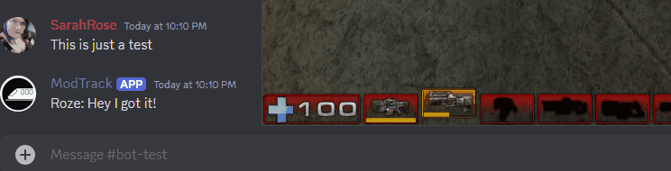

# Unreal Tournament 2004 Discord Bridge

That's right, someone decided to create a discord bot for chat on UT2004.

## Setup

Essentially just enable web admin on your server, update the config.ini file (created after first run) and that's it.
Chat will be bridged between a discord channel and your UT2004 server. Enjoy

Note* If you have a pre-existing chat log (started the bot mid-match) then it will forward previous messages so that you are caught up.

