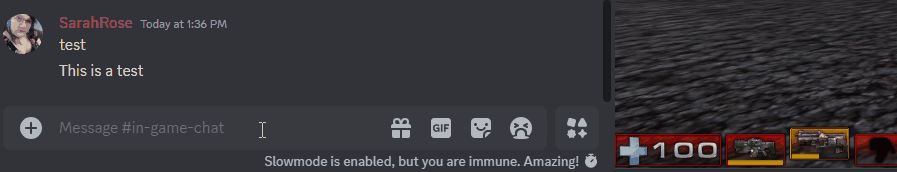

# Unreal Tournament 2004 Discord Bridge

That's right, someone decided to create a discord bot for chat on UT2004.

This was originally based on manipulating WebAdmin but thanks to 'TheAstroPath' we now have a mutator to facilitate communication with our bot.


## UT2004 Setup

Install the UT2k4DiscordBridge.u and .ucl files into your UT2004 'System' Folder.
A config ini is created after first run. Class name for the mutator to add to your config is:

```UT2k4DiscordBridge.DiscordBridge```




## Discord Bot Setup

Modify the config.ini file that's created on first run with your discord bot's secret token, chat channel id, and if needed a different port and ip address for the Mutator/UT2004 Game.

## Contributors

TheAstroPath: https://github.com/theastropath - Mutator Development